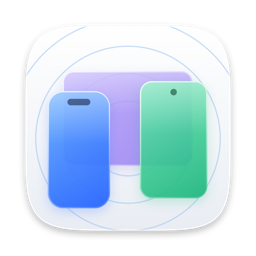
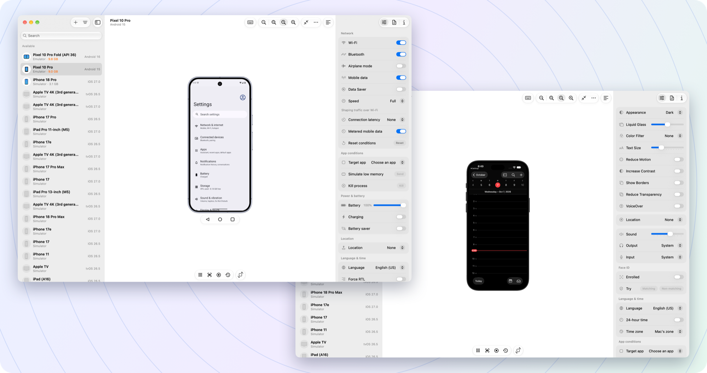
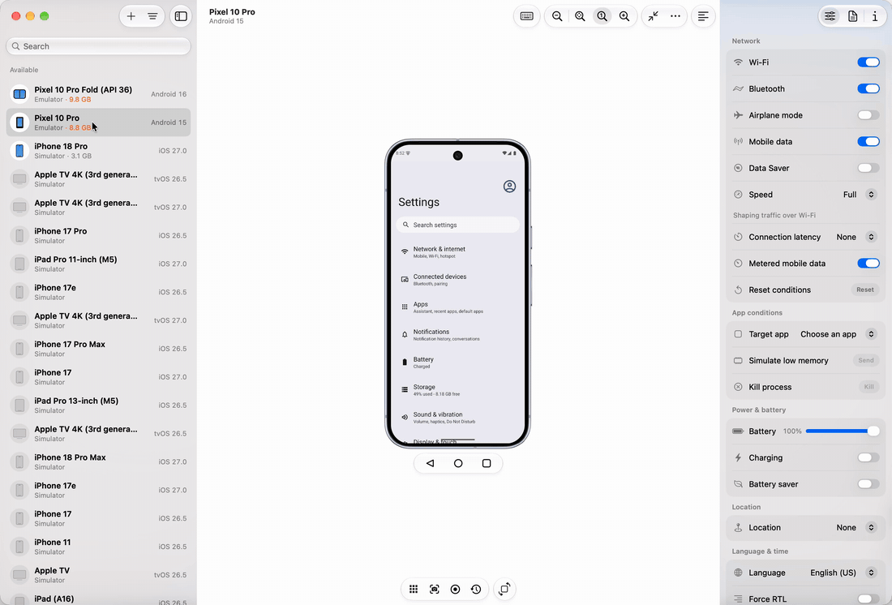
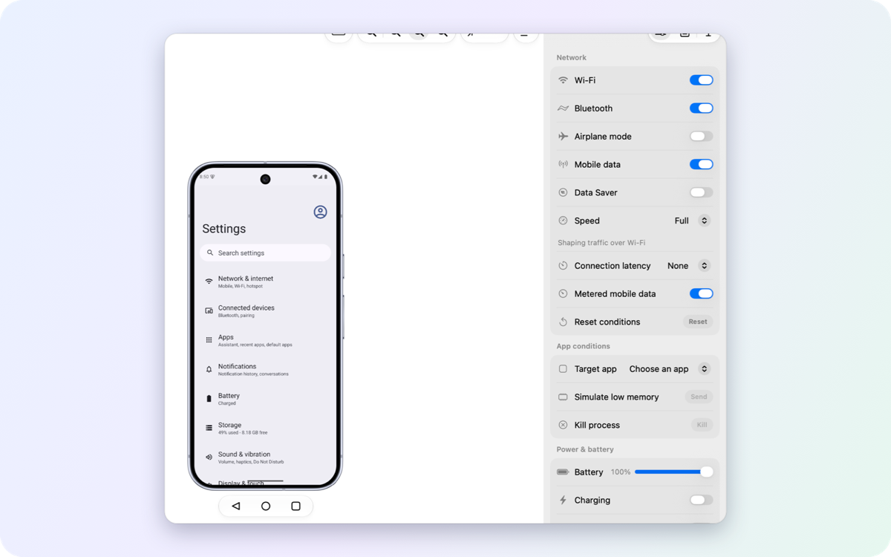
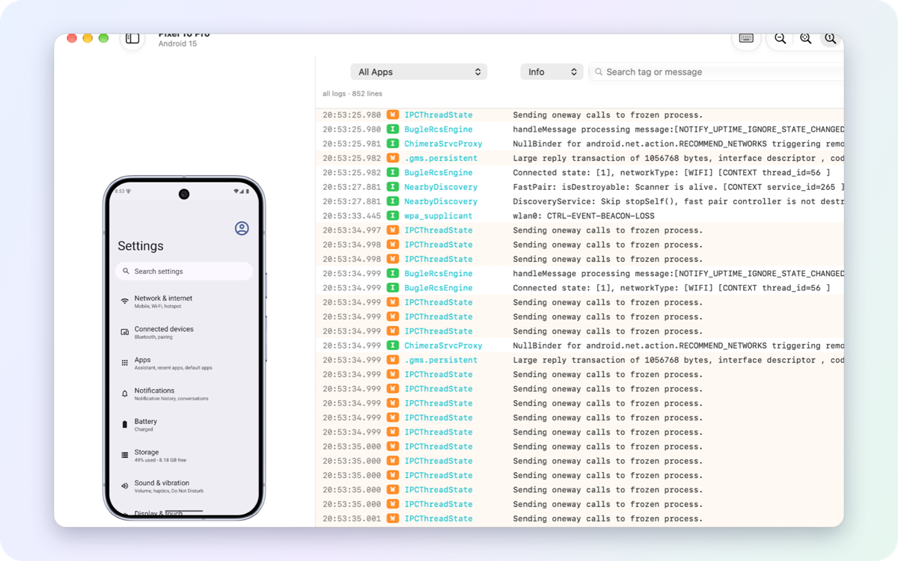
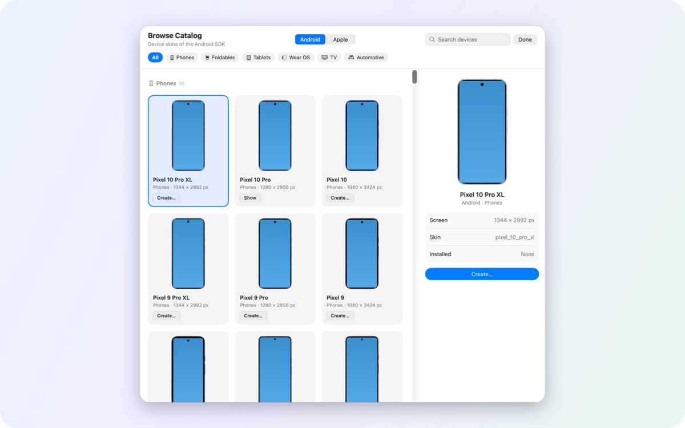
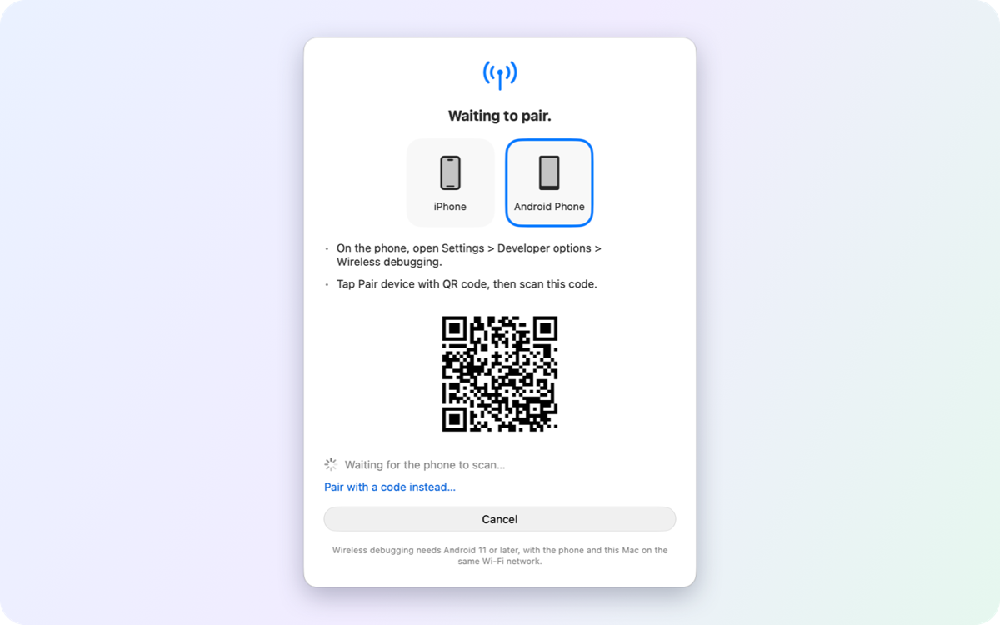

  

<h1 align="center">Device Hub Pro</h1>

  Android and iOS devices, side by side on your Mac. 
  Free and open source.

  <a href="https://github.com/gitemre/device-hub-pro/releases/latest"><b>Download</b></a> ·
  <a href="docs/features.md">Features</a> ·
  <a href="docs/troubleshooting.md">Help</a>

  

   
  Pick a device, change a setting, see it on the device at once.

<table>
  <tr>
    <td width="50%"> <b>Controls</b> · network, battery, location, appearance and more, read back from the device</td>
    <td width="50%"> <b>Logs</b> · live, filtered by app, level or text, next to the device</td>
  </tr>
  <tr>
    <td width="50%"> <b>Emulators</b> · create any Pixel from the catalog; images download in the background</td>
    <td width="50%"> <b>Wireless</b> · pair an Android phone by QR code and keep it on Wi-Fi</td>
  </tr>
</table>

## What it does

- 📱 **All your devices in one list:** emulators, Android phones, iOS simulators, iPhones
- 🪞 **Mirror and control:** up to 60 fps, click, type, rotate, hardware buttons
- 🎛️ **Change device settings:** dark mode, text size, network, battery, location, language…
- 📸 **Capture:** screenshots, screen recordings, logs, crash reports
- 📦 **Manage apps:** drag and drop to install, launch, clear data, open deep links
- 🧰 **No Android Studio needed:** the app installs Google's tools for you

## Install

1. [Download the latest `.dmg`](https://github.com/gitemre/device-hub-pro/releases/latest)
2. Drag **Device Hub Pro** to Applications
3. Open it. Updates arrive inside the app.

## Requirements

- macOS 26 or later on an Apple silicon Mac
- **Android:** nothing; the first launch sets it up
- **iOS:** Xcode
- **iPhone (optional):** turn it on in Settings; pair the phone in Xcode and switch on Developer Mode ([details](docs/features.md#everything-it-does))

## Good to know

- 🔒 **No tracking:** no accounts, analytics or telemetry.
- ⚠️ **Some iOS features use private Apple interfaces** (simulator touch, iPhone fast input and live view). Each can be turned off, and a macOS or Xcode update may break them for a while.

## More

[Features](docs/features.md) · [Troubleshooting](docs/troubleshooting.md) · [Changelog](CHANGELOG.md) · [Contributing](CONTRIBUTING.md) · [Security](SECURITY.md)

MIT License · © 2026 Emre Özturk and contributors
